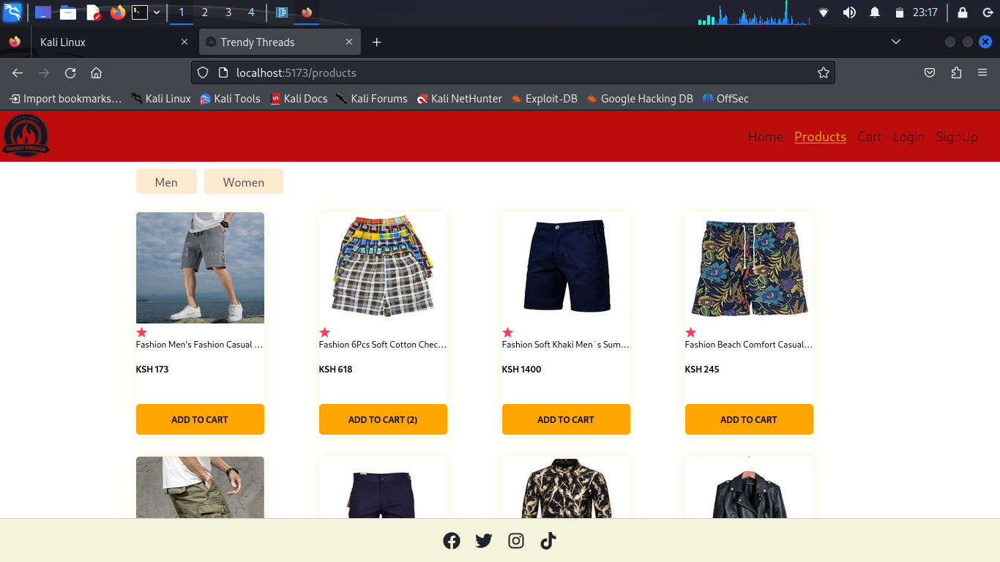

# TRENDY THREADS
## INTRODUCTION
This directory contains of both frontend and backend.It is an e-commerce based web application focusing on clothing. The frontend is done with React framework and the backend with Flask python framework.

## INSTALLATION
Clone this repository: ```git clone "https://github.com/ManNjoro/trendy_threads.git"```  
Access frontend directory: ```cd frontend```  
Access backend directory: ```cd backend```  

## PROJECT LINKS
- Deployed site - [Trendy Threads](https://mannjoro.github.io/trendy_threads_frontend/)
- Project blog - [Blog post](https://www.linkedin.com/posts/eli-john-gachago-306a23238_react-flask-project-blog-activity-7130501078701228034-pq3x?utm_source=share&utm_medium=member_desktop)

## SCREENSHOT OF SITE


## AUTHORS
Eli John Gachago - [Github](https://github.com/ManNjoro) / [Linked In](www.linkedin.com/in/eli-john-gachago-306a23238)

## LICENSE
Public Domain. No copy write protection.
